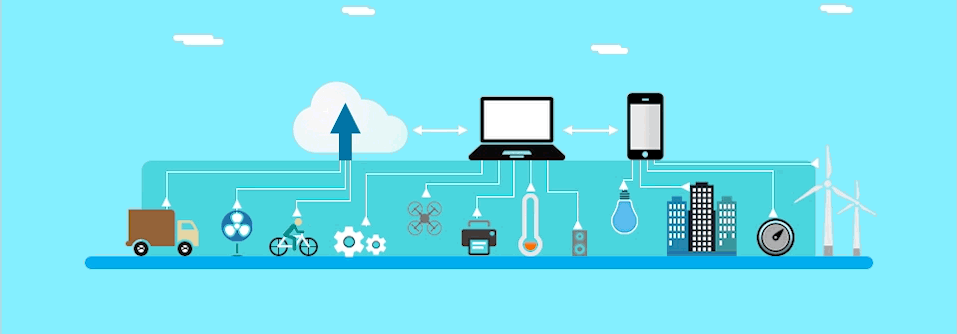

  
  

### 
Hi 👋, I'm Poyan Amini Habibi
  
<h3 align="center">A passionate Mobile Developer and Active in the field of iot</h3> 

- 🔭 I’m currently working on [Android_Tailanco.ir](https://tailanco.com/) & Iot_SMI new progect & [Android_Karyabishoma.ir](https://karyabishoma.ir/)

- 🌱 I’m currently learning [Katlin_M3]([https://developer.android.com/jetpack/compose](https://m3.material.io/))

- ❓ Ask me about anything related to Modern Android Developement and Iot

- 📫 How to reach me **Amini.poyan@gmail.com**

- 📃 You can see **[My Resume](https://ir.linkedin.com/in/poyan-amini-6551896b)**
  

   

## My Skill Set  
<table><tr><td valign="top" width="33%">

### Frontend  

  
  
  
    
  
  
  
  
  
  
  

</td><td valign="top" width="33%">

### Backend  

  
  
  
  
 

  
  
  

</td><td valign="top" width="33%">

### Just For Fun :D 

  
  

</td></tr></table>  

   

## Connect with me  

  

  
  

   

## Donate Me
 

<!--      -->
    

 

